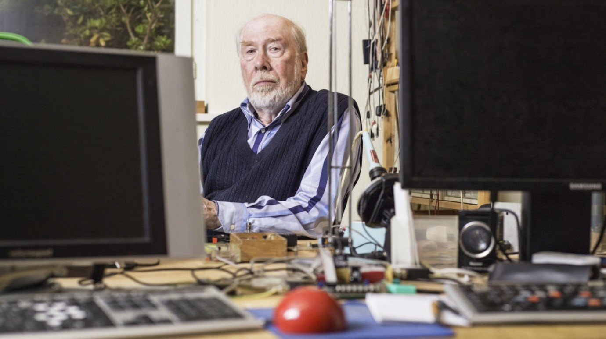
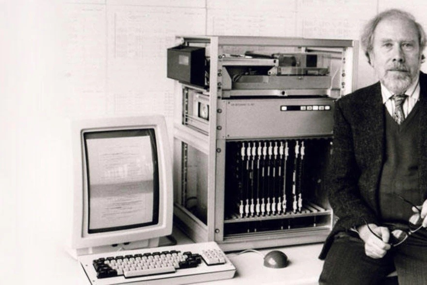

# Esisalama / Description du projet
-------------------------------------------------------
## I) Lien vers notre site:  
__Notre Site; clique ici:__ [Esisalama](https://esisalama.netlify.app)
## II) Participants:  
1. 20BM025 BIBENTYO MURHIMANYA Anathole
2. 20MS422 MWAMBA SUMAILI René
3. 20NK480 KITENGE NKULU Nabil 
4. 20FM053 FURAHA MULAMBA Linda
5. 20MK391 MUSASA KABWE Winner
6. 20AM001 ADIRODU MBADUALE Richard
7. 20PK501 PANDEMOYA KABULA Salem
8. 20KM243 KINAMA MAMBWE Magali
9. 20KM196 KASUMBA MUTAMBA Vainquer
10. 20SW511 SANGWA WA KALUNGA Christ  
## a) Pour notre travail, nous avons utilisés:  
* Html  
* Css  
* Javascript  
* Bootstrap 5/Js
* Bootstrap 5/Css  
## b) Les difficultés rencontrées:  
* Pour faire une barre de navigation responsive, c'était difficile mais nous y sommes parvenus
* Faire la meme présentation de l'horaire comme celui de Esis
* Vu qu'on avait pas eu assez de temps pour apprendre bootstrap, il nous a fallu beaucoup de temps pour l'apprehender grace à la documentation
## c) Les points forts de notre site:   
* Le rensposive sur tous les écrans; surtout de la barre de navigation qui est spécialise
* Notre footer qui est bien designé
* Nos images claires et nettes qu'on a utilisées
* Le bon design surtout l'expérience utilisateur qui sera facile
* La carte maps qui utilise aussi la localisation par satélitte dans les pays où c'est fonctionnel
## d) Les points faibles:  
* Notre page des horaires qui n'est pas rensponsive; et on a pas pu bien caché le contenu des horaires
## e) Historique de Mr Niklaus Wirth:  
« Je savais que je n’étais pas un homme d’affaires, mais j’avais assez à faire avec l’enseignement et la recherche. »  
  
Né le 15 février 1934, à Winterthour, en Suisse, Niklaus Wirth sera diplômé de __l'Ecole polytechnique de Zurich (EPF)__, titulaire d'une maîtrise en sciences de  
l'Université de Laval (Québec) ainsi que Docteur à l'Université de Californie à Berkeley (Etats-Unis).  

Il est professeur-assistant à l'université Stanford de 1963 à 1967, puis professeur d'informatique à l'École polytechnique fédérale de Zurich, où il restera jusqu'à sa retraite.  

__En 1972, il donne naissance à un langage de programmation, Le langage PASCAL__  
  
  Le langage de programmation __PASCAL__ fut nommé de la sorte en hommage au mathématicien Blaise Pascal, créateur de la première machine à calculer en 1642 (à l'époque "machine arithmétique").
C'est en 1972 que l'informaticien Niklaus Wirth, marquera l'histoire du code informatique, avec l'aide d'un de ses étudiants, Urs Amman.
__Le langage de programmation PASCAL__ rencontrera un franc succès dès sa création.
En effet, il bénéficie d'une syntaxe claire, particulièrement adaptée à l’enseignement. 
Le PASCAL participera notamment à l'enseignement de la programmation structurée, un sous-ensemble de la programmation impérative, célèbre pour son principe de suppression de l'usage de l'instruction "goto" (présente dans de nombreux langages de programmation).
Bien que célèbre pour ce langage de programmation, Niklaus Wirth est à l'origine de plusieurs autres outils informatiques : l'Euler, l'Algol-W, ou encore le ModulaTous. Tous ont un point commun : ils se distinguent par la clarté de leur concept et par leur grande simplicité. Ce qui les rend parfaitement utilisable à des fins pédagogiques. 
Très vite, __le PASCAL__ sera utilisé pour le système d’exploitation des ordinateurs Apollo, la première version d’Adobe Photoshop mais aussi une partie du système du Macintosh.
Dans les années 70, Niklaus fait le choix de traverser l'Atlantique avec sa femme et ses trois enfants, pour aller vivre un an au PARC, un centre de recherche informatique près de San Francisco.
Durant cette année, l'informaticien suisse participera à de nombreuses recherches qui feront changer le cours de l'histoire informatique.
Il y travaillera notamment sur le premier ordinateur personnel, quelques années avant l'invention du Macintosh par Steve Jobs (qui, lui-même, s'inspirera des travaux du PARC).
Niklaus Wirth revient de ce voyage en l’Europe des idées plein la tête et ramène une invention pour le moins novatrice : l'une des premières souris pour ordinateur.  Cela conduira à la première production en série de souris au monde, par la société suisse Logitech.
  
  __Niklaus Wirth marque l'histoire de l'informatique__  
  
En parallèle, Niklaus travaille au début des années 1980 sur la construction de stations de travail Lilith et Ceres ainsi que de systèmes d’exploitation. A l’époque, il n'existe pas d’ordinateurs personnels en Suisse. Il choisit donc d'en créer un lui-même. 
  
    
Il conçoit __l'ordinateur personnel Lilith__ (cf. image ci-dessus), qu'il dote d'une interface utilisateur moderne avec des fenêtres de programme, des menus ainsi qu’une souris.
C'est une réelle révolution pour l'époque, qui fera avancer le monde de la recherche informatique.
Suite à cette invention, l'ordinateur Lilith est produit en plusieurs centaines d'exemplaires aux Etats-Unis, mais ne connaîtra cependant pas de franc succès...
Pourtant, quelques années après, __le Macintosh d'Apple triomphera sur la scène internationale,__ en se basant sur les mêmes principes de conception.  
## f) Nos remerciements  
Nous disons merci au prof Emmanuel Ntumba et toute son équipe entre autre nous remercions Mr Gael et Mr Joeboy car c'est grace à vous que nous sommes   
parvenus à corriger le site de Esis et vous avez mis en application le principe du LMD qui consiste à mettre l'étudiant au centre de sa formation; vraiment grand Merci  
Que Dieu vous benisse.  

## H) Lien vers notre site:  
Notre Site; clique ici: [Esisalama](https://esisalama.netlify.app)

